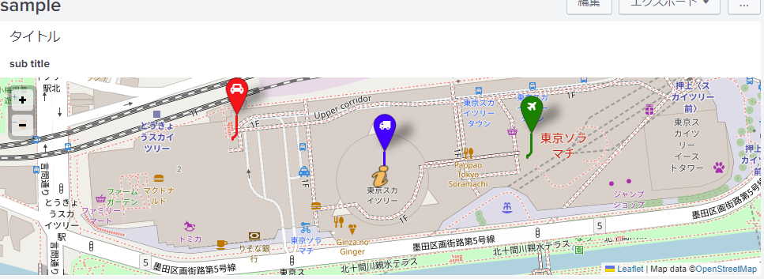

# viz_location_map

Location mapping visualization for splunk.  
Most people would be better off using the wonderful tool that is Location Tracker!  
I'm creating only to overlay kml file.  

# screenshot

### query
```
source="http:sample" (index="main") lat != ""
| eval icon = case(name=="A1", "truck", name=="B1", "plane", name=="C1", "car")
| eval color = case(name=="A1", "blue", name=="B1", "green", name=="C1", "red")
| table _time lat lon name icon color | sort _time
```




# Dependencies

## leaflet
[BSD-2-Clause license](https://github.com/Leaflet/Leaflet/blob/main/LICENSE)

## leaflet-kml
[MIT License](https://github.com/windycom/leaflet-kml)


## Leaflet.vector-markers
[MIT License](https://github.com/hiasinho/Leaflet.vector-markers/blob/master/LICENSE)

## font-awesome
[License](https://github.com/FortAwesome/Font-Awesome)

## bootstrap
[License](http://getbootstrap.com/)


## jquery
[License](https://jquery.org/license/)
